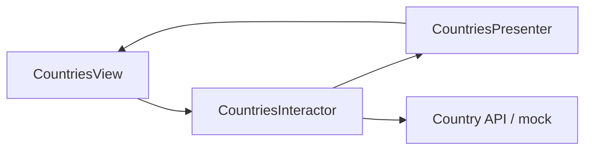

# CountriesVIP


VIP (View–Interactor–Presenter) architecture — a modern Swift rewrite of the classic countries assignment, styled for fintech portfolio demos.

## Highlights

| Area | Implementation |
|------|----------------|
| **VIP** | Strict View → Interactor → Presenter boundaries |
| **Concurrency** | `async/await` country fetch |
| **UI** | Dark fintech presentation layer |
| **Testing** | Interactor unit tests without SwiftUI |

## VIP layers

| Layer | Type | Role |
|-------|------|------|
| **View** | `CountriesView` | SwiftUI, user events, renders state |
| **Interactor** | `CountriesInteractor` | Business logic, async data fetch |
| **Presenter** | `CountriesPresenter` | Formats data for the view |
| **Entity** | `Country` | Plain models |
| **Router** | *(inline in app shell)* | Navigation wiring |

Data flows **View → Interactor → Presenter → View**; the interactor never imports SwiftUI.

## Architecture



## Screenshots

Replace `docs/screenshots/countries-list.png` with a loaded list capture (see [docs/screenshots/README.md](docs/screenshots/README.md)).

| Countries list |
|---|
|  |

**Screen recordings:** Simulator → **Record Screen**.

## Build & run

```bash
xcodegen generate
open CountriesVIP.xcodeproj
# iPhone simulator → ⌘R
```

CI: `xcodebuild -project CountriesVIP.xcodeproj -scheme CountriesVIP -destination 'generic/platform=iOS Simulator' CODE_SIGNING_ALLOWED=NO build`

Tests: ⌘U.

## Revolut-relevant signals

- Strict layer boundaries (testable interactors)
- `async/await` loading
- Presentation separated from domain logic
- Portfolio-friendly VIP reference implementation

*Fintech-inspired — not affiliated with Revolut Ltd.*
